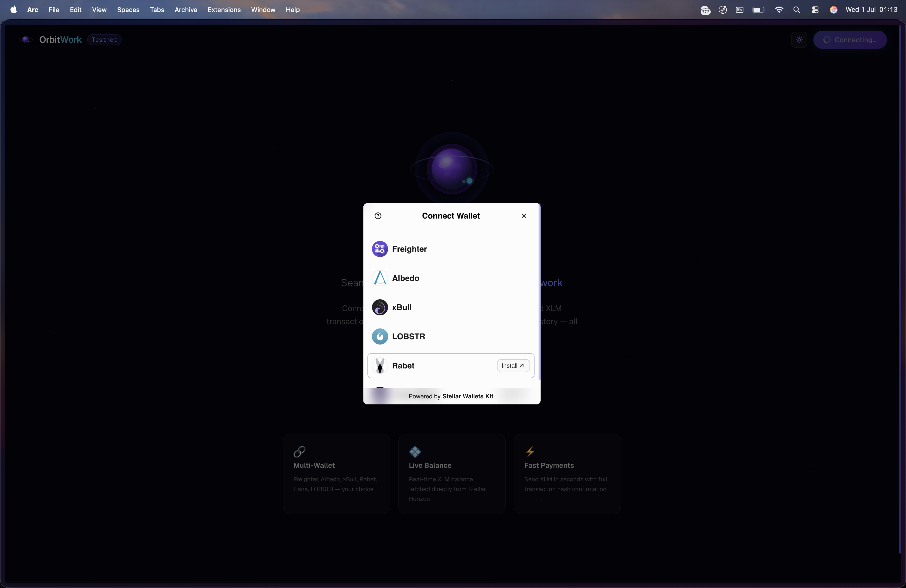
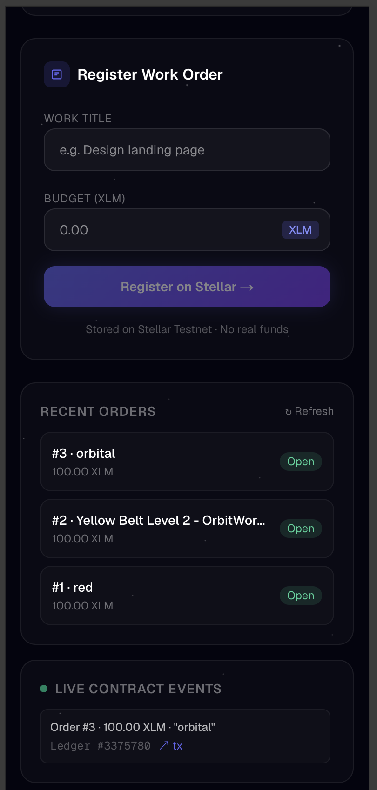
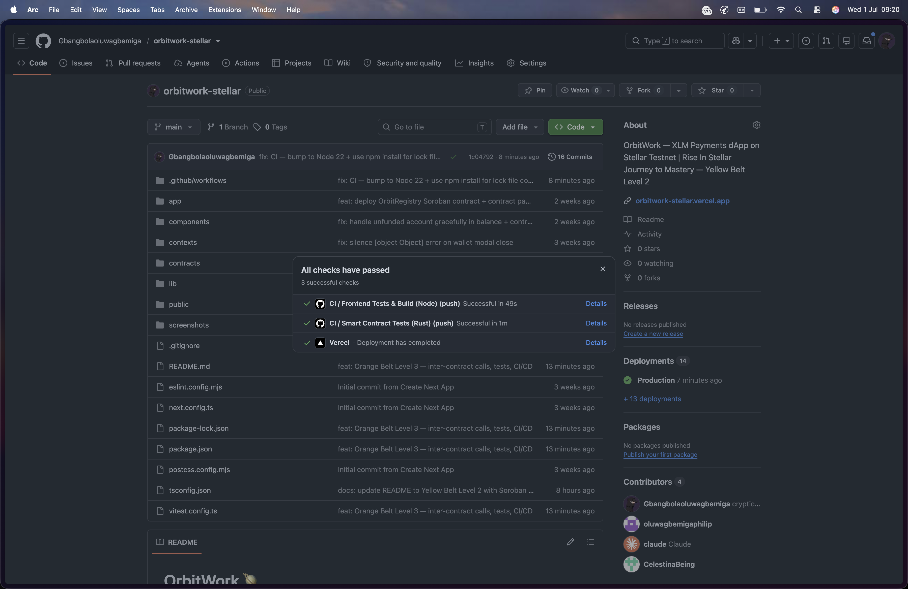
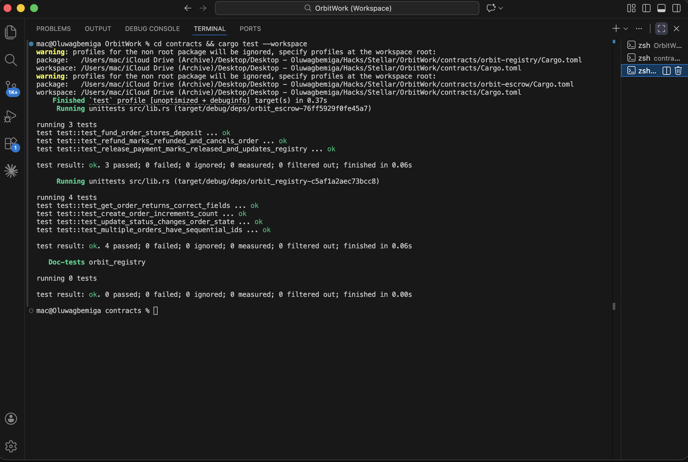
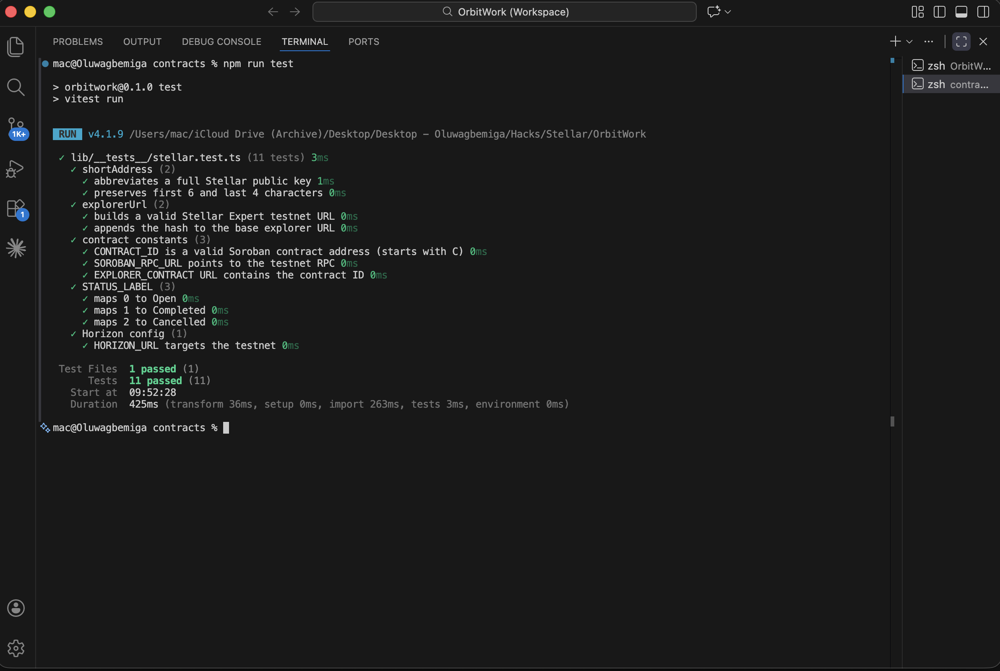

# OrbitWork 🪐

<div align="center">

**A production-ready Stellar dApp — multi-wallet, Soroban smart contracts with inter-contract calls, escrow payments, CI/CD, and real-time event streaming.**

[](https://github.com/Gbangbolaoluwagbemiga/orbitwork-stellar/actions/workflows/ci.yml)
[](https://stellar.org)
[](https://nextjs.org)
[](https://typescriptlang.org)
[](https://soroban.stellar.org)

> **Rise In — Stellar Journey to Mastery · Orange Belt Level 3 Submission**

</div>

---

## Smart Contracts (Orange Belt Level 3)

### OrbitRegistry — Deployed Contract

| Field | Value |
|---|---|
| **Contract ID** | `CBWAGSMUHYU2LNFGQ6CJ4B6DCUJILOZZU4GNIGCYYWWQQBGCUOL3Q43H` |
| **Network** | Stellar Testnet |
| **Deploy Transaction** | `15bdf15b5a255c608603c4d3a9f716ec0eeb1b99fb57e8f6924b395da08f2e79` |
| **Explorer** | [View contract](https://stellar.expert/explorer/testnet/contract/CBWAGSMUHYU2LNFGQ6CJ4B6DCUJILOZZU4GNIGCYYWWQQBGCUOL3Q43H) |

### Contract Call Transaction

| Field | Value |
|---|---|
| **Function** | `create_order` |
| **Transaction Hash** | `5322718448f82a2a65c8a7f1ce2b3424f07319babaa5777d55054cdcedc03652` |
| **Result** | Order #2 — "Yellow Belt Level 2 - OrbitWork Registry Demo" |
| **Explorer** | [View on Stellar Expert](https://stellar.expert/explorer/testnet/tx/5322718448f82a2a65c8a7f1ce2b3424f07319babaa5777d55054cdcedc03652) |

### Inter-Contract Communication

OrbitEscrow calls OrbitRegistry via `env.invoke_contract()` — the core Orange Belt feature:

```
User calls: escrow.release_payment(client, order_id)
    │
    └─► env.invoke_contract(registry_id, "update_status", [order_id, 1])
              └─► OrbitRegistry.update_status(order_id, status=1 /*completed*/)
                        └─► emits "status" event on-chain
```

Source: [`contracts/orbit-escrow/src/lib.rs`](contracts/orbit-escrow/src/lib.rs)

---

## Table of Contents

- [Overview](#overview)
- [Live Demo](#live-demo)
- [Orange Belt Level 3 Features](#orange-belt-level-3-features)
- [Smart Contracts](#smart-contracts-orange-belt-level-3)
- [CI/CD Pipeline](#cicd-pipeline)
- [Tests](#tests)
- [Tech Stack](#tech-stack)
- [Architecture](#architecture)
- [Getting Started](#getting-started)
- [Usage Guide](#usage-guide)
- [Error Handling](#error-handling)
- [What I Learned](#what-i-learned)
- [Roadmap](#roadmap)

---

## Overview

OrbitWork is a decentralized application (dApp) built on the **Stellar blockchain**. This is the Orange Belt Level 3 submission for the Rise In *Stellar Journey to Mastery* program.

Level 3 goes beyond beginner demos into production architecture:

- **Two Soroban contracts** with real inter-contract communication
- **7 Rust tests** (contract-level) + **11 Vitest tests** (frontend)
- **CI/CD via GitHub Actions** — runs all tests on every push
- **Mobile-responsive UI** with real-time event streaming
- Production-ready patterns: persistent storage, TTL extension, auth propagation

---

## Live Demo

🚀 **Deployed:** [orbitwork-stellar.vercel.app](https://orbitwork-stellar.vercel.app)

🎥 **Demo Video:** [Watch on Loom](https://www.loom.com/share/21e4c56110b249159396bc63c5d154c7)

---

## Orange Belt Level 3 Features

### ✅ Advanced Smart Contract Development

Two production-grade Soroban contracts:

**OrbitRegistry** — Work order registry with full CRUD:
- `create_order` — stores `WorkOrder` struct in persistent storage, emits `created` event
- `update_status` — updates order status, requires client auth, emits `status` event
- `get_order` / `get_count` — read-only queries via simulation

**OrbitEscrow** — Escrow payment manager with inter-contract calls:
- `initialize` — sets the trusted registry contract address
- `fund_order` — records escrow deposit, emits `funded` event
- `release_payment` — marks deposit released, **calls registry to set status=completed**
- `refund` — marks deposit refunded, **calls registry to set status=cancelled**
- `get_deposit` — read-only query

### ✅ Inter-Contract Communication

OrbitEscrow calls OrbitRegistry using Soroban's `env.invoke_contract()`:

```rust
// In OrbitEscrow.release_payment()
let args: Vec<Val> = (order_id, 1u32).into_val(&env);
env.invoke_contract::<bool>(
    &registry_id,
    &Symbol::new(&env, "update_status"),
    args,
);
```

The client's auth (from the top-level transaction) propagates through the sub-invocation, satisfying `require_auth()` inside `update_status`.

### ✅ Event Streaming & Real-Time Updates

- `fetchContractEvents()` polls Soroban RPC for `created` and `status` events
- Event feed auto-refreshes every 15 seconds in the Contract Panel
- Each event shows order ID, amount, title, ledger number, and tx hash link

### ✅ Multi-Wallet Support

StellarWalletsKit supports Freighter, Albedo, xBull, LOBSTR, Rabet and more.



### ✅ Error Handling & Loading States

5 error types classified for clear UX: `wallet_not_found`, `wrong_network`, `rejected`, `insufficient`, `contract`. Every async operation has loading spinner, error banner, and success state.

### ✅ Mobile Responsive Frontend

Full Tailwind CSS responsive design — works on mobile, tablet, and desktop. Hamburger menu on mobile with slide-down drawer.



### ✅ CI/CD Pipeline

GitHub Actions runs contract tests + frontend tests + build on every push to `main`. See [CI/CD Pipeline](#cicd-pipeline) section.



---

## CI/CD Pipeline

`.github/workflows/ci.yml` runs two parallel jobs on every push:

```yaml
jobs:
  contracts:          # cargo test --workspace (7 Rust tests)
  frontend:           # npm test (11 Vitest tests) + npm run build
```

[](https://github.com/Gbangbolaoluwagbemiga/orbitwork-stellar/actions/workflows/ci.yml)

The pipeline:
1. Installs Rust stable + `wasm32-unknown-unknown` target
2. Runs `cargo test --workspace` across both Soroban contracts
3. Installs Node 20 + npm dependencies
4. Runs `npm test` (Vitest)
5. Runs `npm run build` (Next.js production build)

---

## Tests

### Rust Contract Tests — 7 passing

```
orbit-registry: 4 tests
  test_create_order_increments_count        ... ok
  test_get_order_returns_correct_fields     ... ok
  test_update_status_changes_order_state    ... ok
  test_multiple_orders_have_sequential_ids  ... ok

orbit-escrow: 3 tests
  test_fund_order_stores_deposit                         ... ok
  test_release_payment_marks_released_and_updates_registry ... ok  ← inter-contract
  test_refund_marks_refunded_and_cancels_order           ... ok  ← inter-contract
```



Run locally:
```bash
cd contracts
cargo test --workspace
```

### Frontend Tests — 11 passing (Vitest)

```
lib/__tests__/stellar.test.ts
  shortAddress            ✓ abbreviates a full Stellar public key
  shortAddress            ✓ preserves first 6 and last 4 characters
  explorerUrl             ✓ builds a valid Stellar Expert testnet URL
  explorerUrl             ✓ appends the hash to the base explorer URL
  contract constants      ✓ CONTRACT_ID is a valid Soroban contract address
  contract constants      ✓ SOROBAN_RPC_URL points to the testnet RPC
  contract constants      ✓ EXPLORER_CONTRACT URL contains the contract ID
  STATUS_LABEL            ✓ maps 0 to Open
  STATUS_LABEL            ✓ maps 1 to Completed
  STATUS_LABEL            ✓ maps 2 to Cancelled
  Horizon config          ✓ HORIZON_URL targets the testnet
```



Run locally:
```bash
npm test
```

---

## Tech Stack

| Layer | Technology |
|---|---|
| Framework | Next.js 16 (App Router) |
| Language | TypeScript 5 |
| Styling | Tailwind CSS 4 (mobile-responsive) |
| Wallet | StellarWalletsKit + Freighter API v6 |
| Blockchain SDK | Stellar SDK v15 (`@stellar/stellar-sdk`) |
| Smart Contracts | Soroban SDK v22 (Rust) — 2 contracts |
| Contract Testing | Soroban testutils + `env.mock_all_auths()` |
| Frontend Testing | Vitest |
| CI/CD | GitHub Actions |
| RPC | Soroban RPC (`https://soroban-testnet.stellar.org`) |
| Network | Stellar Testnet |
| Deployment | Vercel |

---

## Architecture

```
OrbitWork
│
├── .github/workflows/
│   └── ci.yml                     # CI/CD: Rust tests + Vitest + build
│
├── contracts/
│   ├── Cargo.toml                 # Workspace — both contracts
│   ├── orbit-registry/
│   │   ├── Cargo.toml
│   │   └── src/lib.rs             # create_order, update_status, get_order, get_count
│   └── orbit-escrow/
│       ├── Cargo.toml
│       └── src/lib.rs             # initialize, fund_order, release_payment, refund
│
├── lib/
│   ├── stellar.ts                 # Horizon: balance, sendXLM, helpers
│   ├── contract.ts                # Soroban RPC: createOrder, fetchEvents
│   └── __tests__/
│       └── stellar.test.ts        # 11 Vitest tests
│
├── components/
│   ├── contract-panel.tsx         # Soroban contract UI
│   ├── balance-card.tsx           # XLM balance
│   └── send-xlm-form.tsx          # XLM payment form
│
└── app/
    └── page.tsx                   # Dashboard
```

### Inter-Contract Call Flow

```
User signs tx → escrow.release_payment(client, order_id)
    │
    ├─ auth: client.require_auth() ✓
    ├─ reads EscrowDeposit from persistent storage
    ├─ marks deposit.released = true
    │
    └─► env.invoke_contract(registry_id, "update_status", [order_id, 1])
              │
              ├─ auth: order.client.require_auth() ✓ (propagated from top-level)
              ├─ reads WorkOrder from persistent storage
              ├─ sets order.status = 1 (completed)
              ├─ stores updated WorkOrder
              └─ emits "status" event on-chain
```

---

## Getting Started

### Prerequisites

| Requirement | Notes |
|---|---|
| Node.js 18+ | LTS recommended |
| npm 9+ | Bundled with Node |
| Freighter wallet | [freighter.app](https://www.freighter.app/) |
| Rust + cargo | Only needed to rebuild contracts |
| Stellar CLI | Only needed to redeploy contracts |

### 1. Clone & Install

```bash
git clone https://github.com/Gbangbolaoluwagbemiga/orbitwork-stellar.git
cd orbitwork-stellar
npm install
```

### 2. Run Dev Server

```bash
npm run dev
# Open http://localhost:3000
```

### 3. Configure Freighter for Testnet

Go to **Settings → Network → Testnet** in Freighter.

### 4. Fund Your Testnet Account

```
https://laboratory.stellar.org/#account-creator?network=test
```

### 5. Run Tests

```bash
# Frontend tests
npm test

# Contract tests
cd contracts
cargo test --workspace
```

### 6. (Optional) Rebuild and Redeploy Contracts

```bash
# Build contracts
cd contracts/orbit-registry
cargo build --target wasm32-unknown-unknown --release

cd ../orbit-escrow
cargo build --target wasm32-unknown-unknown --release

# Deploy registry
stellar contract deploy \
  --wasm contracts/orbit-registry/target/wasm32-unknown-unknown/release/orbit_registry.wasm \
  --source me \
  --network testnet

# Deploy escrow
stellar contract deploy \
  --wasm contracts/orbit-escrow/target/wasm32-unknown-unknown/release/orbit_escrow.wasm \
  --source me \
  --network testnet
```

---

## Usage Guide

### Connecting Your Wallet

1. Click **"Connect Wallet"** — wallet selection modal appears (Freighter, Albedo, xBull, LOBSTR)
2. Choose your wallet provider and approve the connection
3. Dashboard loads with live XLM balance

### Creating a Work Order (Smart Contract)

1. Find the **Stellar Smart Contract** section on the dashboard
2. Enter a **title** and **amount** in XLM
3. Click **"Create Order on Testnet"** and confirm in Freighter
4. Status bar: Signing → Submitting → Success
5. Event feed updates with the new `created` event

### Sending XLM

1. Enter a destination Stellar address and amount
2. Click **Send XLM →** and confirm in Freighter

---

## Error Handling

| Type | Trigger | Message |
|---|---|---|
| `wallet_not_found` | Extension not installed | Wallet not found — install Freighter |
| `wrong_network` | Freighter on Mainnet | Switch Freighter to Testnet |
| `rejected` | User cancelled signing | Transaction rejected |
| `insufficient` | Unfunded account (404) | Fund via testnet faucet |
| `contract` | Simulation or chain error | Contract error with details |

---

## What I Learned

### Level 3 (Orange Belt)

1. **Inter-contract communication** — `env.invoke_contract()` with typed args via `IntoVal`. Soroban's auth propagates through the full call tree so `require_auth()` in sub-invoked contracts is satisfied by the top-level signature.

2. **Cross-crate test setup** — Soroban contracts must expose `rlib` (not just `cdylib`) to be importable as dev-dependencies for inter-contract integration tests.

3. **`env.mock_all_auths()`** — mocks all `require_auth()` calls in the test environment, allowing clean unit tests without real keypairs.

4. **GitHub Actions for Rust** — `dtolnay/rust-toolchain` action + `wasm32-unknown-unknown` target for Soroban contract builds in CI.

5. **Vitest for Next.js** — pure utility function testing with `vitest run`, avoiding the complexity of React component testing in CI.

6. **Soroban persistent storage TTL** — `extend_ttl()` must be called after every write or storage entries will expire on testnet.

### Levels 1–2 Recap

7. Stellar account model, Freighter auth architecture, Horizon API
8. Soroban SDK v15 namespace (`import { rpc as SorobanRpc }`) breaking change
9. Soroban full RPC flow: simulate → assemble → sign → submit → poll

---

## Roadmap

| Level | Belt | Status | Focus |
|---|---|---|---|
| 1 | ⚪ White Belt | ✅ Accepted | Wallet connect, XLM balance, send transaction |
| 2 | 🟡 Yellow Belt | ✅ Accepted | Multi-wallet, Soroban contract, real-time events |
| 3 | 🟠 Orange Belt | 🔄 Submitted | Inter-contract calls, tests, CI/CD, production architecture |
| 4 | 🟢 Green Belt | ⏳ | Production MVP, advanced features |
| 5 | 🔵 Blue Belt | ⏳ | 50 users, feedback loop, pitch deck |
| 6 | ⚫ Black Belt | ⏳ | Mainnet launch, 30+ users, security audit |
| 7 | 🏆 Master Belt | ⏳ | Ecosystem acceleration, investor visibility |

---

## License

MIT © [Oluwagbemiga Gbangbola](https://github.com/Gbangbolaoluwagbemiga)

---

<div align="center">

Built with ❤️ on [Stellar](https://stellar.org) · Submitted to [Rise In](https://risein.com)

**Orange Belt — Level 3 · Stellar Journey to Mastery**

</div>
